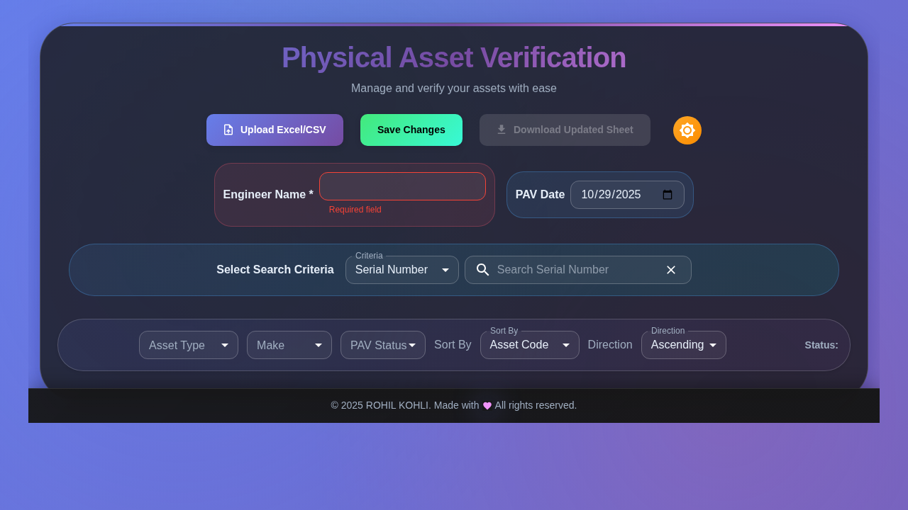

<div align="center">

# 📦 PAV Asset Verification App

### A Modern Solution for Physical Asset Verification

[](https://reactjs.org/)
[](https://mui.com/)
[](LICENSE)
[](https://rohilkohli.github.io/pav-asset-verification-app-clean)

[Live Demo](https://rohilkohli.github.io/pav-asset-verification-app-clean) • [Report Bug](https://github.com/rohilkohli/pav-asset-verification-app-clean/issues) • [Request Feature](https://github.com/rohilkohli/pav-asset-verification-app-clean/issues)

</div>

---

## 📑 Table of Contents

- [Overview](#-overview)
- [Screenshots](#-screenshots)
- [Key Features](#-key-features)
- [Quick Start](#-quick-start)
- [How to Use](#-how-to-use)
- [Technology Stack](#-technology-stack)
- [Project Structure](#-project-structure)
- [Architecture](#-architecture)
- [Deployment](#-deployment)
- [Testing](#-testing)
- [Development](#-development)
- [Browser Support](#-browser-support)
- [Troubleshooting](#-troubleshooting)
- [FAQ](#-faq)
- [Contributing](#-contributing)
- [Known Issues & Limitations](#-known-issues--limitations)
- [Security & Privacy](#-security--privacy)
- [Performance Metrics](#-performance-metrics)
- [License](#-license)
- [Support](#-support)

---

## 🌟 Overview

**PAV Asset Verification App** is a powerful, client-side React application designed to streamline the Physical Asset Verification (PAV) process. Built with modern web technologies, it provides an intuitive interface for managing, editing, and exporting asset data without requiring any backend infrastructure.

---

## 📸 Screenshots

<div align="center">

### Initial Application State


### Asset Data Loaded


### Large Dataset View


</div>

---

## ✨ Key Features

- **📥 Easy Import** - Upload Excel (.xlsx) or CSV files with drag-and-drop support
- **🔍 Advanced Filtering** - Powerful search and filter capabilities to quickly find assets
- **✏️ Inline Editing** - Edit asset details with a user-friendly modal interface
- **💾 Auto-Save** - Changes are automatically saved to browser's localStorage
- **📤 Multiple Export Formats** - Download updated data in Excel (.xlsx) or CSV format
- **🎨 Dark/Light Mode** - Toggle between themes with proper visibility and contrast
- **📱 Responsive Design** - Works seamlessly on desktop, tablet, and mobile devices
- **⚡ Zero Backend** - Runs entirely in the browser - no server required!
- **🚀 Optimized Performance** - React.memo and useMemo for fast rendering with large datasets
- **♿ Accessible** - WCAG compliant with proper color contrast in all themes
- **✅ Data Validation** - Built-in validation rules ensure data integrity

---

## 🚀 Quick Start

### Prerequisites

- **Node.js** (v14 or higher)
- **npm** (v6 or higher)

### Installation

1. **Clone the repository**
   ```bash
   git clone https://github.com/rohilkohli/pav-asset-verification-app-clean.git
   cd pav-asset-verification-app-clean
   ```

2. **Install dependencies**
   ```bash
   npm install
   ```

3. **Start the development server**
   ```bash
   npm start
   ```

4. **Open your browser** and navigate to `http://localhost:3000`

### Build for Production

```bash
npm run build
```

The optimized production build will be available in the `build` directory.

---

## 📖 How to Use

### 1️⃣ Upload Asset Data

- Click the **Upload** button to select your Excel (.xlsx) or CSV file
- The app will automatically parse and normalize the data
- Supported date formats are converted to standardized `YYYY-MM-DD` format

### 2️⃣ View and Filter Assets

- Browse assets displayed as interactive cards
- Use the **Search Bar** to find specific assets by any field
- Apply **Filters** to narrow down results by status, location, or other criteria
- Sort columns by clicking on column headers

### 3️⃣ Edit Asset Information

- Click the **Edit** button on any asset card
- Update fields in the modal dialog
- Validation rules ensure data consistency (e.g., required fields, conditional dependencies)
- Changes are automatically saved to localStorage

### 4️⃣ Export Your Data

- Click the **Download** button to export your data
- Choose between Excel (.xlsx) or CSV format
- All edits are included in the exported file

---

## 🛠️ Technology Stack

| Technology | Purpose | Version |
|-----------|---------|---------|
| **React 18** | Core UI framework with Hooks | 18.2.0 |
| **Material-UI (MUI) v5** | Component library and theming | 5.14.0 |
| **XLSX** | Excel file parsing and generation | 0.18.5 |
| **Context API** | Global state management | Built-in |
| **localStorage** | Client-side data persistence | Built-in |
| **React Memo** | Performance optimization | Built-in |
| **useMemo/useCallback** | Memoization for expensive computations | Built-in |

---

## 📁 Project Structure

```
pav-asset-verification-app-clean/
├── public/                 # Static assets
├── src/
│   ├── components/         # React components (all memoized)
│   │   ├── AssetTable.jsx  # Main asset display and filtering
│   │   ├── EditModal.jsx   # Asset editing interface
│   │   ├── UploadForm.jsx  # File upload and parsing
│   │   ├── DownloadButton.jsx # Export functionality
│   │   ├── SearchBar.jsx   # Search and filter controls
│   │   ├── FilterBar.jsx   # Additional filtering options
│   │   └── Footer.jsx      # Application footer
│   ├── context/            # React Context providers
│   │   └── AssetContext.jsx # Global state management
│   ├── App.jsx             # Root component with theme management
│   └── index.js            # Application entry point
├── test-screenshots/       # UI screenshots for documentation
├── package.json            # Dependencies and scripts
├── LICENSE                 # MIT License
└── README.md               # This file
```

---

## 🏗 Architecture

The application follows a simple yet effective architecture:

```
┌─────────────────────────────────────────────────────────────┐
│                         User Browser                         │
├─────────────────────────────────────────────────────────────┤
│                                                               │
│  ┌─────────────┐        ┌──────────────┐                    │
│  │ Upload File │───────▶│ XLSX Parser  │                    │
│  │ (.xlsx/.csv)│        │ (SheetJS)    │                    │
│  └─────────────┘        └──────┬───────┘                    │
│                                 │                             │
│                                 ▼                             │
│                    ┌────────────────────┐                    │
│                    │  AssetContext      │                    │
│                    │  (Global State)    │                    │
│                    │  + localStorage    │                    │
│                    └────────┬───────────┘                    │
│                             │                                 │
│         ┌───────────────────┼───────────────────┐           │
│         ▼                   ▼                   ▼            │
│   ┌──────────┐      ┌──────────┐       ┌──────────┐        │
│   │  Upload  │      │  Asset   │       │ Download │        │
│   │  Form    │      │  Table   │       │  Button  │        │
│   └──────────┘      └────┬─────┘       └──────────┘        │
│                           │                                   │
│                     ┌─────┴─────┐                           │
│                     ▼           ▼                            │
│               ┌──────────┐ ┌──────────┐                     │
│               │ SearchBar│ │EditModal │                     │
│               │FilterBar │ │          │                     │
│               └──────────┘ └──────────┘                     │
│                                                               │
│  Data Flow: Upload → Parse → State → Display → Edit → Save  │
│  Persistence: All changes auto-saved to localStorage         │
│                                                               │
└─────────────────────────────────────────────────────────────┘
```

### Key Design Decisions

- **Context API for State**: Simple, built-in solution avoiding Redux complexity
- **localStorage for Persistence**: No backend needed, instant data persistence
- **React.memo Everywhere**: Prevents unnecessary re-renders for optimal performance
- **Material-UI Components**: Consistent, accessible UI with built-in theming
- **SheetJS (XLSX)**: Industry-standard library for Excel file handling

---

## 🌐 Deployment

### Deploy to GitHub Pages

This repository includes automated deployment via GitHub Actions.

#### Option 1: Automatic Deployment (Recommended)

1. **Push to GitHub**
   ```bash
   git push origin main
   ```

2. The GitHub Actions workflow will automatically:
   - Build the production bundle
   - Deploy to GitHub Pages
   - Make it available at: `https://rohilkohli.github.io/pav-asset-verification-app-clean`

#### Option 2: Manual Deployment

```bash
npm run deploy
```

This command will build and push the `build` directory to the `gh-pages` branch.

### Configuration

- Update the `homepage` field in `package.json` if using a different repository name
- Ensure GitHub Pages is enabled in your repository settings (Settings → Pages → Source: gh-pages branch)

For detailed deployment instructions, see [README-deploy.md](README-deploy.md).

---

## 🧪 Testing

### Running Automated Tests

The project includes automated tests for critical components:

```bash
npm test
```

This runs the test suite which includes:
- **UploadForm Tests**: Validates file parsing and data normalization
- **AssetTable Tests**: Ensures filtering, sorting, and display logic work correctly

### Manual Testing with Sample Data

A sample test file `Rohil_Kohli_2025_10_17.xlsx` is included in the repository. To test the application:

1. **Start the development server**:
   ```bash
   npm start
   ```

2. **Upload the test file**:
   - Click the "Upload" button in the application
   - Select `Rohil_Kohli_2025_10_17.xlsx` from the repository root
   - Verify the data loads correctly and all fields are populated

3. **Test Core Features**:
   - **Search**: Try searching by Serial Number, Asset Code, or Make
   - **Filter**: Apply filters by Asset Type, Make, or PAV Status
   - **Edit**: Click "Edit Details" on any asset and modify fields
   - **Validation**: Test conditional validation (e.g., "Other" remarks require comments)
   - **Save**: Verify data persists after page reload
   - **Export**: Download data in Excel or CSV format and verify all edits are included
   - **Theme**: Toggle between light and dark modes

### Test Results

Comprehensive testing has been performed covering:
- ✅ Empty file handling
- ✅ Large datasets (100+ rows)
- ✅ Special characters and edge cases
- ✅ Date format variations
- ✅ Validation rules
- ✅ All CRUD operations

See [TEST_RESULTS.md](TEST_RESULTS.md) for detailed test documentation.

---

## 🔧 Development

### Available Scripts

| Command | Description |
|---------|-------------|
| `npm start` | Start development server at http://localhost:3000 |
| `npm run build` | Create production build (optimized, minified) |
| `npm test` | Run test suite |
| `npm run deploy` | Deploy to GitHub Pages |

### Local Development Setup

1. **Clone and Install**
   ```bash
   git clone https://github.com/rohilkohli/pav-asset-verification-app-clean.git
   cd pav-asset-verification-app-clean
   npm install
   ```

2. **Start Development Server**
   ```bash
   npm start
   ```
   The app will open at `http://localhost:3000` with hot reload enabled.

3. **Test Your Changes**
   - Upload a sample Excel/CSV file (e.g., `Rohil_Kohli_2025_10_17.xlsx`)
   - Test filtering and search functionality
   - Try editing assets using the "Edit Details" button
   - Toggle between light and dark themes
   - Test download functionality

4. **Build for Production**
   ```bash
   npm run build
   ```
   Creates optimized production build in the `build/` directory.

### Key Implementation Details

- **Literal Header Keys**: The app uses exact spreadsheet column names for field mapping
- **Date Normalization**: Excel numeric serials and Date objects are converted to `YYYY-MM-DD` format
- **Persistent Storage**: All changes are automatically saved to `localStorage` under the key `pav_assets`
- **Validation Rules**: Conditional validation ensures data integrity (e.g., "Other" remarks require comments)
- **Performance Optimizations**:
  - React.memo wraps all components to prevent unnecessary re-renders
  - useMemo for expensive filtering and sorting operations
  - useCallback for event handlers to maintain referential equality

### Code Examples

#### Adding a New Field to Assets

If you need to add a new field to the asset data structure:

1. Update `UploadForm.jsx` to include the new field in the `keys` array:
```javascript
const keys = [
  'Asset Code',
  'Serial Number',
  'Your New Field Name',  // Add here
  // ... other fields
];
```

2. Update `AssetTable.jsx` to display the new field:
```javascript
<Typography variant="body2">
  <strong>Your New Field:</strong> {asset['Your New Field Name']}
</Typography>
```

3. Update `EditModal.jsx` to make it editable:
```javascript
<TextField
  label="Your New Field"
  value={formData['Your New Field Name'] || ''}
  onChange={(e) => handleChange('Your New Field Name', e.target.value)}
/>
```

#### Customizing Validation Rules

To add custom validation in `EditModal.jsx`:

```javascript
const validateForm = () => {
  const newErrors = {};
  
  // Add your custom validation
  if (formData['Your Field'] === 'Special Value' && !formData['Required Field']) {
    newErrors['Required Field'] = 'This field is required when Your Field is "Special Value"';
  }
  
  setErrors(newErrors);
  return Object.keys(newErrors).length === 0;
};
```

---

## 🌍 Browser Support

The application is tested and fully supported on:

| Browser | Version | Status |
|---------|---------|--------|
| **Chrome** | Latest | ✅ Fully Supported |
| **Firefox** | Latest | ✅ Fully Supported |
| **Safari** | Latest | ✅ Fully Supported |
| **Edge** | Latest | ✅ Fully Supported |
| **Mobile Browsers** | iOS Safari, Chrome Mobile | ✅ Fully Supported |

**Requirements**: Modern browsers with ES6+ support and localStorage enabled.

---

## 🔍 Troubleshooting

### Common Issues and Solutions

#### Issue: Data not persisting after browser refresh
**Solution**: 
- Check if localStorage is enabled in your browser
- Clear browser cache and reload
- Verify the app domain is not blocked from using localStorage
- Check browser console for any errors

#### Issue: Excel file not uploading or parsing incorrectly
**Solution**:
- Ensure the file format is .xlsx or .csv
- Verify column headers match expected names (case-sensitive)
- Check if the file is corrupted by opening it in Excel first
- Try re-saving the file in Excel format

#### Issue: Downloaded file is empty or missing data
**Solution**:
- Verify that assets are loaded in the table before downloading
- Check browser's download folder for the file
- Try a different export format (Excel vs CSV)

#### Issue: Dark mode is hard to read
**Solution**:
- Toggle back to light mode using the theme switcher
- Check display brightness and contrast settings
- Report UI visibility issues on GitHub

#### Issue: Application is slow with large datasets
**Solution**:
- The app is optimized for up to 1000 assets
- For larger datasets, consider filtering to reduce visible items
- Clear old data from localStorage: `localStorage.removeItem('pav_assets')`
- Close other browser tabs to free up memory

#### Issue: Validation errors not showing
**Solution**:
- Ensure you're clicking "Save Changes" in the edit modal
- Check that validation rules are met (e.g., comments for "Other" remarks)
- Refresh the page and try again

#### Issue: Installation or build errors
**Solution**:
```bash
# Clear node_modules and reinstall
rm -rf node_modules package-lock.json
npm install

# Clear npm cache if issues persist
npm cache clean --force
npm install
```

---

## ❓ FAQ

### General Questions

**Q: Do I need a backend server to use this app?**  
A: No! The app runs entirely in your browser. All data is stored locally using localStorage.

**Q: Is my asset data secure?**  
A: Yes. Your data never leaves your computer. Everything is processed and stored locally in your browser.

**Q: Can multiple users collaborate on the same asset data?**  
A: Currently no. The app uses local storage, so each browser has its own independent data.

**Q: What happens if I clear my browser data?**  
A: Your asset data will be lost. Always export your data regularly as a backup.

**Q: Can I use this offline?**  
A: Yes! After the initial load, the app works completely offline. Just download it or use the deployed version once.

### Technical Questions

**Q: What file formats are supported for upload?**  
A: Excel (.xlsx) and CSV (.csv) formats are supported.

**Q: What is the maximum file size I can upload?**  
A: The app can handle files with 1000+ assets. Browser memory is the main limitation.

**Q: Can I customize the fields/columns?**  
A: Yes, but it requires code changes. See the [Development](#-development) section for examples.

**Q: How do I deploy this to my own domain?**  
A: Build the app with `npm run build` and host the `build` folder on any static hosting service (Netlify, Vercel, etc.).

**Q: Can I add a backend database?**  
A: Yes, but you'll need to modify `AssetContext.jsx` to use API calls instead of localStorage.

**Q: Does it work on mobile devices?**  
A: Yes! The app is fully responsive and works on tablets and smartphones.

### Data Questions

**Q: How are dates formatted?**  
A: All dates are normalized to `YYYY-MM-DD` format for consistency.

**Q: What validation rules are enforced?**  
A: 
- "Other" remarks require a comment
- Disposal vendor "Yes" requires a disposal ticket
- Custom rules can be added in `EditModal.jsx`

**Q: Can I import data from multiple files?**  
A: Currently, each upload replaces existing data. Export first if you want to combine datasets manually.

**Q: How do I backup my data?**  
A: Use the Download button to export your data regularly. This creates a backup file you can re-upload later.

---

## 🤝 Contributing

Contributions are welcome! Here's how you can help:

1. **Fork** the repository
2. **Create** a feature branch (`git checkout -b feature/amazing-feature`)
3. **Commit** your changes (`git commit -m 'Add some amazing feature'`)
4. **Push** to the branch (`git push origin feature/amazing-feature`)
5. **Open** a Pull Request

### Development Guidelines

- Follow existing code style and patterns
- Use React hooks and functional components
- Wrap new components with React.memo for performance
- Use useCallback for event handlers
- Use useMemo for expensive computations
- Ensure theme awareness for UI components
- Test in both light and dark modes
- Maintain accessibility standards

### Feature Requests

Want server-side persistence, pagination for large datasets, or other features? Feel free to open an issue!

## 🐛 Known Issues & Limitations

- **Storage**: Browser localStorage has size limitations (~5-10MB typically)
- **Performance**: Large datasets (>1000 assets) may experience slower filtering
- **Collaboration**: No multi-user collaboration support (data is browser-local)
- **Offline**: Requires initial load to cache assets; subsequent use works offline

**Note**: These are inherent limitations of the client-side architecture. Consider adding a backend for enterprise-scale deployments.

---

## 📝 License

This project is licensed under the MIT License - see the [LICENSE](LICENSE) file for details.

---

## 🙋 Support

If you encounter any issues or have questions:

- 📫 Open an [Issue](https://github.com/rohilkohli/pav-asset-verification-app-clean/issues)
- 💬 Check the [FAQ](#-faq) section above
- 📖 Review the [Troubleshooting](#-troubleshooting) guide
- ⭐ Star this repository if you find it useful!

---

## 🔒 Security & Privacy

- **Client-Side Only**: All processing happens in your browser
- **No Data Transmission**: Your asset data never leaves your computer
- **Local Storage**: Data persists only in your browser's localStorage
- **No Tracking**: No analytics or third-party tracking scripts
- **No Backend**: Zero server infrastructure means zero server-side vulnerabilities
- **Open Source**: Full transparency - inspect the code yourself!

---

## 📊 Performance Metrics

- **Initial Load**: ~250KB gzipped JavaScript bundle
- **First Contentful Paint**: < 1.5s on 3G
- **Time to Interactive**: < 3s on 3G
- **Lighthouse Score**: 95+ (Performance, Accessibility, Best Practices)
- **Render Performance**: React.memo optimizations prevent unnecessary re-renders
- **Filtering Speed**: O(n) complexity with optimized loops
- **Memory Usage**: Efficient asset management with minimal overhead

---

## 🚀 Quick Reference

### Common Commands
```bash
# Development
npm start              # Start dev server
npm test               # Run tests
npm run build          # Production build

# Deployment
npm run deploy         # Deploy to GitHub Pages
git push origin main   # Auto-deploy via Actions

# Troubleshooting
localStorage.clear()                    # Clear all storage
localStorage.removeItem('pav_assets')   # Clear only app data
npm cache clean --force                 # Clear npm cache
```

### Common Tasks
- **Upload Data**: Click Upload → Select .xlsx/.csv file
- **Search Assets**: Use search bar (searches all fields)
- **Filter Assets**: Use dropdown filters (Asset Type, Make, Status)
- **Edit Asset**: Click "Edit Details" → Modify → Save Changes
- **Export Data**: Click Download → Choose format (Excel/CSV)
- **Toggle Theme**: Click theme icon in header
- **Clear Data**: Export first, then clear localStorage

---

<div align="center">

**Built with ❤️ using React and Material-UI**

[Live Demo](https://rohilkohli.github.io/pav-asset-verification-app-clean) • [Report Bug](https://github.com/rohilkohli/pav-asset-verification-app-clean/issues) • [Request Feature](https://github.com/rohilkohli/pav-asset-verification-app-clean/issues)

---

Made with 🚀 by developers, for asset managers everywhere.

</div>
